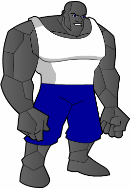

# BRICK

**Real Name:** Jimmy Mason 
**Mental Malfunction:**

**Brawn:** x5 
**Agility:** x1 
**Mind:** x1

**Soak:** x5 (x8 Armour) 
**Defense:** x1 
**Mental Defense:** x1

**Hero Points:** 
**Hero Dice:** 
**Character Points:** 14 Stats + 11 Powers = 25 Total

## Powers

### Armour 3
Personal, Sustained, 3 Points

### Granite Strike
Multi-Power (Special Attack, Push), 6 Points

#### Special Attack 5
Range, Area, 5 Points

x3 Hit, x8 Damage

#### Push 5
Range, Area, 5 Points

x 3 Hit, x16 Damage for Knock-back only.

### Boost (Brawn) 2
Situational, 2 Points

Brawn is boosted by 2 when angered (at half Hits).

## Skills

## Advantages

## Disadvantages
