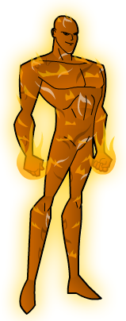

# INFERNO

**Real Name:** 
**Mental Malfunction:**

**Brawn:** 2 
**Agility:** 2 
**Mind:** 2

**Soak:** 2 
**Defence:** 2 
**Mental Defence:** 2

**Hero Points:** 
**Hero Dice:** 
**Character Points:** 12 Stats + 13 Powers = 25 Total

## Powers

### Fire Mastery 1
Maintained, Concentration, 1 Point

### Flight 2
Maintained, Limitation: Not Underwater or in Vacuum or in Super-Rain, 1 Point

### Immunity: Fire
Personal, Sustained, 1 Point

### Fire Generation
Multi-Power (Fire Blast + Damage Shield), 10 Points

#### Fire Blast
Linked Special Attack and Continual Damage, 9 Points

##### Special Attack 4
Range, Area, Variable, 5 Points

##### Continual Damage 1
Range, Area, Variable, 2 Points

#### Damage Shield 5
Range, Area, Concentration, Variable, Weakness (Water does double damage), 5 Points

## Skills

## Advantages

## Disadvantages
