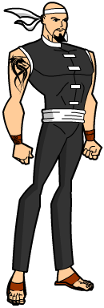

# SHADOWFIST — Master of the Martial Arts

**Real Name:** Quai Chin 
**Mental Malfunction:** Driven to clean up China Town of the Tongs he was once a part of.

**Brawn:** 2 
**Agility:** 2 
**Mind:** 1

**Soak:** x2 (x4 against unarmed attacks) 
**Defence:** x2 (x4 against hand-to-hand attacks) 
**Mental Defence:** x1

**Hero Points:** 
**Hero Dice:** 
**Character Points:** 10 Stats + 15 Powers = 25 Total

An orphan raised by the Tongs in China Town, Quai Chin learned the martial arts the hard way, as an enforcer on the streets and in the back alleys fighting tooth and nail for the only family he had ever known. His physical and mental toughness got him noticed by the leaders of the Tongs and they sent him to train with their martial arts masters. After this training, Quai Chin was thrown into the brutal, underground fight tournament scene. These tournaments showed Quai Chin the bottomless depths of depravity of his so-called family, and are what finally convinced him to break away from the Tongs and become a great champion of the downtrodden people of China Town fighting against the very gangsters he used to be a part of. His displeasure known, men were sent to "deal" with him, and he managed to fake his death at their hands. Quai Chin died that night, but Shadowfist was born!

## Powers

### Martial Arts Mastery
3 Points, Personal

**Fast Style, Kung-Fu:** Your priority is based on your Agility+1. In addition, if you are knocked down, you can immediately get up (“kippup”) by making a 20 Athletics/Acrobatics check. It takes none of your movement to stand like this. 
**Tough Style, Kick-Boxing:** You can take a hit. Your Brawn is considered 2 higher for soaking damage and Knock-Back caused by unarmed attacks (to a maximum of 5). This benefit does not overlap with the Armour power (use whichever is better). 
**Defensive Style, Karate:** You can avoid a blow. Your Agility is 2 higher (to a max of 5) for defending against hand-to-hand attacks (fists, swords, etc). 
**Grappling Style, Judo:** You can more easily reverse an opponent’s hold and use their strength against them. You can get a reversal whenever you beat a foe in a grapple by 10, and you can achieve a reversal whenever a Brawn Contest is used by your grappling opponent (not only on your own panel). In addition, if your Brawn is equal or less than your opponent’s, it is 1 higher for resolving any wrestling actions. 
**Tricky Style, Street Fighting:** You can lure foes in to attack and then hit them when they leave an opening. If a hand-to-hand attack misses you, and you rolled doubles on your defense roll, you can make an immediate unarmed counter attack.

### Attack Weak Point
2 Points

You have a knack for hitting your enemies where it hurts. This is a common ability of assassins who strike from behind or for heroes to take down gigantic foes with precision strikes. If you attack and hit by 20+ you do double damage. Even if you hit by less than 20, you can spend a Hero point to use the dice of your attack roll as the dice of your damage roll.

### Fleet of Foot
1 Point, Personal

You are in excellent shape and very agile. You run your Agility x4 squares per panel, and you jump your Brawn+1 squares. This power is not considered Super Movement and its effects do not combine with it.

### Paired Weapons
2 Points

Each panel you can make two hand-to-hand attacks instead of one, either with a weapon in each hand, or unarmed attacks, but both are made at a -1 Dice penalty.

### Swift Strike
2 Points

You attack your foes with great speed, making an extra hand to hand strike per page. This can be combined with paired weapons for even more attacks. All attacks made have a -1 Dice penalty, which stacks with penalties such as from Paired Weapons.

### Weapons Technique 2 (Unarmed)
3 Points, Personal, Variable

You are extremely well trained with the use of a certain weapon. Each point in this power grants a +1 Agility boost to hit or a +1 DM boost to damage with unarmed attacks.

You can improve your unarmed attacks up to a maximum of x5 to hit or damage. You cannot combine the benefits of this power with other powers (except other Intense Training powers).

### Disarm Expert
2 Points

You are adept in relieving foes of their weapons. You get a +2 dice bonus to attacks when you deliberately try to disarm a foe or break his gadget. Even when you don’t call your shot to attack an opponent’s gadget, you can choose to declare the attack a disarm in lieu of damage to the foe, anytime you happen to make any attack roll by 10. If the gadget has the Fragile Limitation, you can roll damage and apply it to the gadget.

## Skills

### Athletics/Acrobatics

### Stealth/Move Silently

### Streetwise/Crime

## Advantages

### Never Surrender
You are not one to give up easily. Once per issue, you may “snap out of it” when unconscious, immobilized, dazed, mind-controlled or under some other ongoing status effect, and restore your Hits to 20 (if they were lower) without spending a Hero die.

### Quick-Thinking
You are always ready to react to danger. Once per issue, you can perform an interrupt action without having to spend a Hero Die.

## Disadvantages

### Normal
You are a normal person, either all the time (and thus all your powers are from gadgets or intense training, and your Brawn and Agility cannot exceed 2) or some of the time (you transform into a super form). This makes you vulnerable at times when you are not in “super” mode. While a “normal” hero may be a skilled martial artist even while in his public normal identity, he does not normally carry around grappler guns!

### Rogue’s Gallery
Over the years you have defeated a lot of costumed ne’er-do-wells, and seem to run into the same ones again and again. You have at least 3 Villains who are enemies of yours that will come after you or cross your path. These Villains are within 5 Character Points of you (if not, they gain Setbacks to make up the difference). Between the three of them, they share a Villain Die.

## Standard Combat Options

### Single Attack
One attack at x2 To-Hit, x2 Damage, Disarm and Weak Point are options.

### Double Attack
Two attacks at -1x2 To-Hit, x2 Damage, Disarm and Weak Point are options.

### Triple Attack
Three attacks at -2x2 To-Hit, x2 Damage, Disarm and Weak Point are options.

### Attack Variables
Accurate Strike: +2 Agility Boost To-Hit 
Balanced Strike: +1 Agility Boost To-Hit, +1 DM Boost 
Powerful Strike: +2 DM Boost

## GM Notes
Shadowfist is a standard Street Level hero, in the points sense (the standard Street Level 25) as well as in the story sense (a martial artist protecting his neighborhood and occasionally the rest of the city). While Shawdowfist is presented as a hero in this write up, he could very easily be used as a villain by changing his story to him never having gained a conscience and staying in the Tongs as an underground champion and privileged enforcer.
